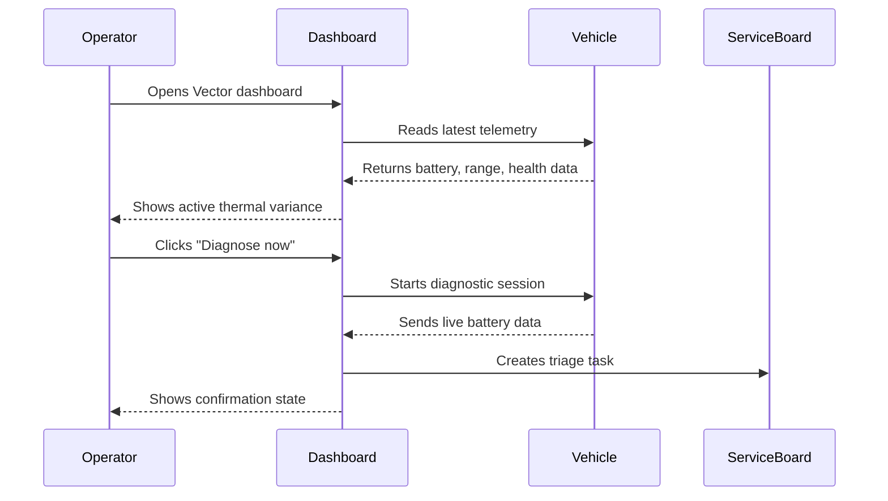

# Vector / Vehicle Intelligence Blueprint

This document explains the structure and interaction model behind the Vector vehicle-operations dashboard.

## Product architecture

```mermaid
flowchart TB
    A["Vector Vehicle Intelligence"] --> B["Application Shell"]

    B --> C["Left Sidebar"]
    C --> C1["Vector logo"]
    C --> C2["Overview"]
    C --> C3["Vehicles"]
    C --> C4["Live Signals"]
    C --> C5["Service Board"]
    C --> C6["User / Data Connection"]

    B --> D["Main Dashboard"]
    D --> D1["Top Bar"]
    D1 --> D2["Date + Greeting"]
    D1 --> D3["Search"]
    D1 --> D4["Notifications"]
    D1 --> D5["Export Report"]

    D --> E["Fleet Health Hero"]
    E --> E1["System Status"]
    E --> E2["Fleet Health 98%"]
    E --> E3["Last Sync Time"]
    E --> E4["Connected Vehicle Count"]

    D --> F["Metric Cards"]
    F --> F1["Fleet Health"]
    F --> F2["Energy Efficiency"]
    F --> F3["Open Signals"]

    D --> G["Operations Workspace"]
    G --> H["Active Signals"]
    H --> H1["Battery Thermal Variance"]
    H --> H2["Radar Calibration"]
    H --> H3["Tire Pressure Imbalance"]

    G --> I["Selected Vehicle"]
    I --> I1["Vehicle Visualization"]
    I --> I2["Battery"]
    I --> I3["Range"]
    I --> I4["Odometer"]
    I --> I5["Open Vehicle Profile"]

    D --> J["Service Board"]
    J --> J1["Triage"]
    J --> J2["Scheduled"]
    J --> J3["Resolved"]
```



## Diagnostic interaction



## Dashboard wireframe

```text
┌────────────────────────────────────────────────────────────────────┐
│ SIDEBAR             │ TOP BAR                                      │
│                     │ Good morning, Khai     Search  Alerts Export │
│ VECTOR              ├───────────────────────────────────────────────┤
│                     │ FLEET HEALTH HERO                            │
│ Overview            │ Fleet health is holding steady        98%     │
│ Vehicles            ├───────────────────────────────────────────────┤
│ Live signals        │ HEALTH     EFFICIENCY     OPEN SIGNALS        │
│ Service board       ├──────────────────────────────┬───────────────┤
│                     │ ACTIVE SIGNALS               │ VEHICLE V-042  │
│ Data connected      │                              │ Silverado EV   │
│ Khai Nguyen         │ Battery thermal variance    │ Battery 82%    │
│                     │ Radar calibration            │ Range 284 mi   │
│                     │ Tire pressure imbalance      │ Diagnose       │
│                     ├──────────────────────────────┴───────────────┤
│                     │ SERVICE BOARD                                │
│                     │ TRIAGE       SCHEDULED       RESOLVED         │
└─────────────────────┴───────────────────────────────────────────────┘
```

## Design principles

- Safety-critical signals are prioritized by severity.
- Fleet health is visible immediately without opening a detail view.
- Telemetry connects directly to a human service workflow.
- High-contrast colors distinguish healthy, warning, and urgent states.
- The layout scales from an operations desktop to a mobile review screen.

